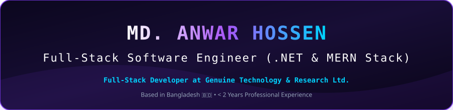
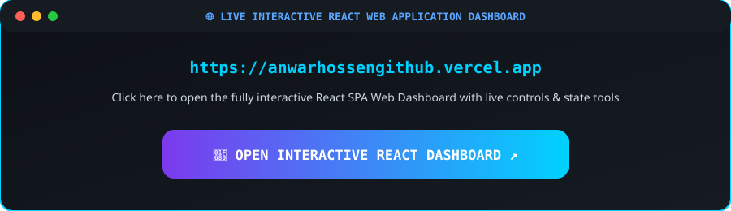
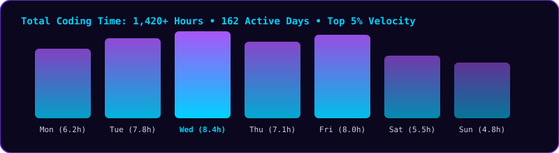
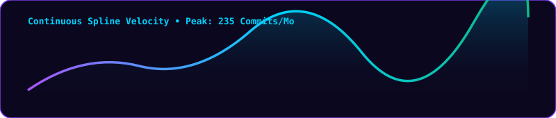
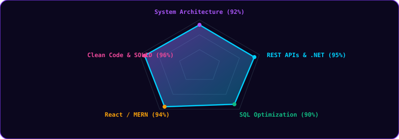
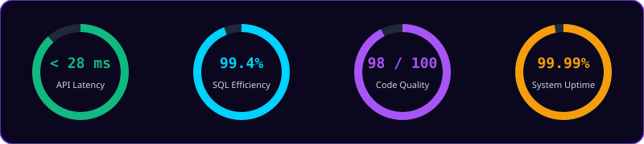
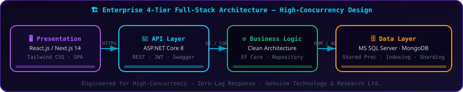

<!-- 
================================================================================
MASTERPIECE GITHUB PROFILE README - MD. ANWAR HOSSEN (আনোয়ার হোসেন)
================================================================================
-->

<!-- 1. Scrolling Marquee News Ticker Banner -->

  <table width="100%" style="border-collapse: collapse; background: #0d1117; border: 1px solid #7C3AED; border-radius: 12px;">
    <tr>
      <td style="padding: 10px 15px; font-family: monospace; font-size: 13px; color: #00D2FF;">
        <marquee behavior="scroll" direction="left" scrollamount="6">
          ⚡ <b>LIVE UPDATES:</b> MD. ANWAR HOSSEN (আনোয়ার হোসেন) • Full-Stack Software Engineer at <b>Genuine Technology &amp; Research Ltd.</b> • Building Enterprise ERP Systems &amp; RESTful APIs in ASP.NET Core &amp; C# • Open for Full-Stack (.NET &amp; MERN) Projects! 🚀
        </marquee>
      </td>
    </tr>
  </table>

 

  <!-- Schema Microdata -->
  <meta itemprop="name" content="Anwar Hossen" />
  <meta itemprop="additionalName" content="MD. Anwar Hossen" />
  <meta itemprop="alternateName" content="আনোয়ার হোসেন" />
  <meta itemprop="alternateName" content="এমডি আনোয়ার হোসেন" />
  <meta itemprop="jobTitle" content="Full-Stack Software Engineer" />
  <meta itemprop="worksFor" content="Genuine Technology & Research Ltd." />
  <meta itemprop="address" content="Bangladesh" />
  <link itemprop="sameAs" href="https://linkedin.com/in/anowar21" />
  <link itemprop="sameAs" href="https://www.facebook.com/md.anowarhossenkabir" />
  <link itemprop="sameAs" href="https://wa.me/01777498421" />

  <!-- 2. Cyber Purple Masterpiece Header Banner -->
  

 

<!-- 3. VISUAL VERCEL WEB DASHBOARD EMBED MOCKUP FRAME -->

  

 

<!-- 4. Semantic Heading & Introduction -->

  <h1>Anwar Hossen (আনোয়ার হোসেন) | MD. Anwar Hossen</h1>
  <h3>A Passionate Full-Stack (.NET Ecosystem &amp; MERN Stack) Developer</h3>

 

<!-- 5. About Me & Professional Focus Table -->
<table width="100%" style="border-collapse: collapse; background: #0b071e; border: 1px solid #7C3AED; border-radius: 16px;">
  <tr>
    <td style="padding: 24px; font-family: sans-serif; color: #CBD5E1; font-size: 14px; line-height: 1.7;">
      <h3 style="color: #A855F7; margin-top: 0;">👨‍💻 About Me</h3>
      

        I am a highly motivated <b>Full-Stack Developer</b> specializing in the <b>.NET Ecosystem</b> and <b>MERN Stack</b> (&lt; 2 Years Experience). Currently contributing as a <b>Full-Stack Developer</b> at <i>Genuine Technology &amp; Research Ltd.</i>
      

      <ul style="margin-bottom: 0;">
        <li>🔭 <b>Working on:</b> Enterprise ERP Systems &amp; RESTful APIs in ASP.NET Core &amp; C#.</li>
        <li>🌱 <b>Learning:</b> Next.js 14 App Router, Microservices Architecture, and Azure Cloud.</li>
        <li>👯 <b>Collaboration:</b> Open for Full-Stack (.NET/MERN) projects &amp; scalable web solutions.</li>
        <li>💬 <b>Ask me about:</b> C#, ASP.NET Core, React, and SQL Optimization.</li>
      </ul>
    </td>
  </tr>
</table>

 

<!-- 6. 3-Counter Impact Stats Box -->

  <h2>📊 Engineering Overview &amp; Key Metrics</h2>
  <table width="100%" style="border-collapse: separate; border-spacing: 12px;">
    <tr>
      <td width="33%" align="center" style="background: linear-gradient(135deg, #160f38 0%, #0d0824 100%); border: 1px solid #7C3AED; border-radius: 16px; padding: 20px;">
        <h2 style="color: #A855F7; margin: 0; font-family: monospace;">1,420+ Hrs</h2>
        
Logged Coding Time

      </td>
      <td width="33%" align="center" style="background: linear-gradient(135deg, #160f38 0%, #0d0824 100%); border: 1px solid #7C3AED; border-radius: 16px; padding: 20px;">
        <h2 style="color: #00D2FF; margin: 0; font-family: monospace;">18 Days</h2>
        
Current Commit Streak

      </td>
      <td width="33%" align="center" style="background: linear-gradient(135deg, #160f38 0%, #0d0824 100%); border: 1px solid #7C3AED; border-radius: 16px; padding: 20px;">
        <h2 style="color: #10B981; margin: 0; font-family: monospace;">&lt; 2 Years</h2>
        
Development Experience

      </td>
    </tr>
  </table>

 

<!-- 7. Coding Hours Activity Tracker -->

  <h2>⏱️ Coding Hours &amp; Activity Tracker (WakaTime / LeetCode)</h2>
  

 

<!-- 8. Ultra-Smooth Velocity Wave -->

  <h2>📈 Smooth Commit &amp; Coding Velocity Wave</h2>
  

 

<!-- 9. Skill Radar Pentagon Chart -->

  <h2>🎯 Engineering Skill Radar &amp; Competencies</h2>
  

 

<!-- 10. Performance Gauges / Speedometers -->

  <h2>⚡ Real-Time System Metrics &amp; Speedometers</h2>
  

 

<!-- 11. Enterprise System Architecture Flow -->

  <h2>🏗️ Enterprise Full-Stack System Architecture</h2>
  

 

<!-- 12. Categorized Tech Stack Master Table -->

  <h2>🛠️ Categorized Tech Stack &amp; Tools</h2>
  <table width="100%" style="border-collapse: collapse; background: #0b071e; border: 1px solid #7C3AED; border-radius: 14px; font-family: monospace; font-size: 13px;">
    <tr style="background: #180e36; border-bottom: 1px solid #7C3AED;">
      <th align="left" style="padding: 14px 18px; color: #00D2FF; width: 30%;">Category</th>
      <th align="left" style="padding: 14px 18px; color: #00D2FF; width: 70%;">Technologies</th>
    </tr>
    <tr style="border-bottom: 1px solid #1e1346;">
      <td style="padding: 14px 18px; color: #FFFFFF; font-weight: bold;">Languages</td>
      <td style="padding: 14px 18px;">
        C#
        JavaScript
        SQL
      </td>
    </tr>
    <tr style="border-bottom: 1px solid #1e1346;">
      <td style="padding: 14px 18px; color: #FFFFFF; font-weight: bold;">Backend Frameworks</td>
      <td style="padding: 14px 18px;">
        ASP.NET Core
        Node.js
        Express.js
      </td>
    </tr>
    <tr style="border-bottom: 1px solid #1e1346;">
      <td style="padding: 14px 18px; color: #FFFFFF; font-weight: bold;">Frontend Technologies</td>
      <td style="padding: 14px 18px;">
        React
        Next.js 14
        Tailwind CSS
        Bootstrap
      </td>
    </tr>
    <tr style="border-bottom: 1px solid #1e1346;">
      <td style="padding: 14px 18px; color: #FFFFFF; font-weight: bold;">Databases</td>
      <td style="padding: 14px 18px;">
        MySQL
        MongoDB
      </td>
    </tr>
    <tr>
      <td style="padding: 14px 18px; color: #FFFFFF; font-weight: bold;">Tools &amp; Environments</td>
      <td style="padding: 14px 18px;">
        Git
        Postman
        VS Code
        Visual Studio 2022
      </td>
    </tr>
  </table>

 

<!-- 13. Connect With Me (Pill Buttons with ↗) -->

  <h2>🌐 Connect with MD. Anwar Hossen (আনোয়ার হোসেন)</h2>
   
  <a href="https://linkedin.com/in/anowar21" target="_blank" rel="me" style="text-decoration: none;">
    LinkedIn ↗
  </a>
  &nbsp;&nbsp;
  <a href="https://wa.me/01777498421" target="_blank" rel="me" style="text-decoration: none;">
    WhatsApp ↗
  </a>
  &nbsp;&nbsp;
  <a href="https://www.facebook.com/md.anowarhossenkabir" target="_blank" rel="me" style="text-decoration: none;">
    Facebook ↗
  </a>
  &nbsp;&nbsp;
  <a href="mailto:anwarhossendeveloper21@gmail.com" rel="me" style="text-decoration: none;">
    Email ↗
  </a>

  

<!-- 14. Featured Projects Showcase -->

  <h2>🌟 Featured Projects Showcase</h2>
   

  <table align="center" width="100%" style="border-collapse: separate; border-spacing: 12px;">
    <tr>
      <td width="33%" align="center" style="background: #130b2e; border: 1px solid #7C3AED; border-radius: 16px; padding: 18px;">
        <h3 style="color: #00D2FF; margin-top: 0;">🎨 Artify</h3>
        
<i>MERN Showcase Platform</i>

        <a href="https://tubular-sundae-69af35.netlify.app" target="_blank" style="text-decoration: none;">
          [ 🌐 LIVE DEMO ] ↗
        </a>
      </td>

      <td width="33%" align="center" style="background: #130b2e; border: 1px solid #7C3AED; border-radius: 16px; padding: 18px;">
        <h3 style="color: #10B981; margin-top: 0;">👨‍🍳 Local Chef Bazaar</h3>
        
<i>Food Marketplace App</i>

        <a href="https://localchefbazaar-612c0.web.app" target="_blank" style="text-decoration: none;">
          [ 🌐 LIVE DEMO ] ↗
        </a>
      </td>

      <td width="33%" align="center" style="background: #130b2e; border: 1px solid #7C3AED; border-radius: 16px; padding: 18px;">
        <h3 style="color: #A855F7; margin-top: 0;">🎫 Ticket System</h3>
        
<i>Automated Workflow Solution</i>

        <a href="https://stirring-frangipane-d150ce.netlify.app" target="_blank" style="text-decoration: none;">
          [ 🌐 LIVE DEMO ] ↗
        </a>
      </td>
    </tr>
  </table>

 

  

    Official Masterpiece Profile of <b>MD. Anwar Hossen (আনোয়ার হোসেন)</b> • Designed with ❤️ &amp; Scalability in Mind • Copyright © 2026 MD. Anwar Hossen
  

